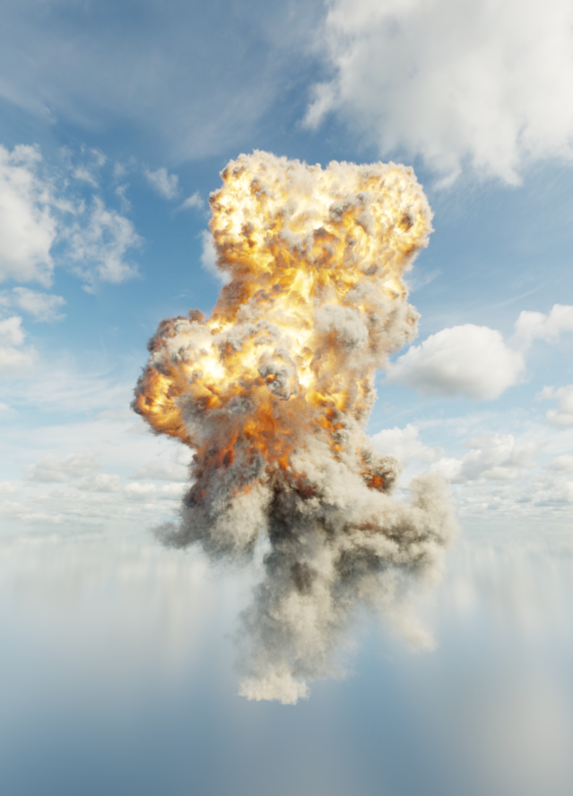

Fluora
================

***Fluora*** is a path tracer built on CUDA and C++, originating from UPenn's CIS-5650 Project 3. It serves as a platform for experimenting with new graphics algorithms and enhancing my GPU programming skills. My goal is to incorporate a broad range of graphics algorithms into Fluora.

At present, ***Fluora*** supports unidirectional path tracing with multiple importance sampling. I am actively developing it to include volume rendering and bidirectional tracing techniques.

## Usage

Command line arguments: `.\Fluora.exe scenefile.txt`

`w`,`a`,`s`,`d` to move camera in first person style, `q` save current picture, press `left mouse button` to rotate camera

## Showcase

|     Ground Explosion (4096 spp)     |
| :---------------------------------: |
|  |

|   Teapot Cloud (5000 spp)   |
| :-------------------------: |
|  |

|     Spectral Varying IOR     |
| :--------------------------: |
|  |

## Principles and Analysis

### Wavelength Dependent Path tracing

Path tracers should use spectral tracing instead of RGB for **physical accuracy**. Light interacts with materials based on its **wavelength**, not RGB. This approach captures effects like dispersion, interference, fluorescence, and accurate material interactions, which RGB approximations cannot. While spectral tracing is computationally expensive, it ensures realism in scenes with complex lighting and materials.

In this approach, we perform **importance sampling** of light based on the **human eye's perception** by selecting **4 wavelengths** per iteration. These wavelengths are chosen to align with the sensitivity of the human visual system, ensuring efficient sampling where it matters most for perceived color.

For each sampled wavelength:

- We compute the **BSDFs** (Bidirectional Scattering Distribution Functions) and **emission properties** specific to that wavelength, accurately capturing the interaction of light with the materials in the scene.
- These calculations account for wavelength-dependent effects, such as dispersion, absorption, and material reflectance.

After accumulating the contributions across iterations, the resulting spectral data is **converted to RGB** using a color-matching function that maps the sampled wavelengths to the RGB color space. This conversion ensures that the final image can be stored in the camera film or display device while preserving perceptual accuracy and realism.

### Volumetric Rendering

In volumetric path tracing, light interacts with participating media (e.g., fog, smoke, or water) through **scattering events**. These events describe how light changes direction or energy within the medium. The main types of scattering are **absorption**, **scattering**, and **emission**.

#### Absorption
Absorption occurs when light energy is absorbed by the medium, reducing the intensity of light passing through it. This process is governed by the **Beer-Lambert law**.

##### Formula:
$$
L_{\text{out}}(x, \omega) = L_{\text{in}}(x, \omega) \cdot e^{-\sigma_a d}
$$
- $ L_{\text{in}}(x, \omega) $: Incident radiance at point $x$ in direction $\omega$.
- $L_{\text{out}}(x, \omega)$: Transmitted radiance after traveling a distance $d$.
- $\sigma_a$: Absorption coefficient of the medium (higher values mean stronger absorption).
- $d$: Distance traveled through the medium.

##### Intuition:
Absorption reduces light intensity based on how much material the light passes through and how strongly the material absorbs light.

#### Scattering
Scattering occurs when light interacts with particles in the medium and is redirected in a new direction. The new direction is determined probabilistically by the **phase function**.

##### Formula for Scattering:
$$
L_s(x, \omega) = \sigma_s \int_{4\pi} L(x, \omega') \cdot p(\omega, \omega') \, d\omega'
$$
- $L_s(x, \omega)$: Scattered radiance at point $x$ in direction $\omega$.
- $\sigma_s$: Scattering coefficient of the medium.
- $p(\omega, \omega')$: Phase function, describing the probability of scattering from direction $\omega'$ to $\omega$.

##### Common Phase Functions:
- **Isotropic scattering**: $p(\omega, \omega') = \frac{1}{4\pi}$, uniform scattering in all directions.
- **Henyey-Greenstein phase function**:
$$
p(\omega, \omega') = \frac{1}{4\pi} \frac{1-g^2}{(1+g^2 - 2g\cos\theta)^{3/2}}
$$
  - $g$: Asymmetry parameter ($g > 0$ for forward scattering, $g < 0$ for backward scattering).

  - $\theta$: Angle between $\omega$ and $\omega'$.

    

#### Emission
Emission occurs when the medium itself emits light, adding energy into the system. This is common in glowing media like flames or phosphorescent fog.

##### Formula:
$$
L_e(x, \omega) = \sigma_e(x, \omega) \cdot e(x, \omega)
$$
- $L_e(x, \omega)$: Emitted radiance at point $x$ in direction $\omega$.

- $\sigma_e(x, \omega)$: Emission coefficient.

- $e(x, \omega)$: Intrinsic emission function, describing how much light is emitted at $x$.

  

#### The Radiative Transfer Equation (RTE)
The interaction of light with participating media is described by the **Radiative Transfer Equation (RTE)**, which combines all three processes.

##### Formula:
$$
\frac{dL(x, \omega)}{ds} = -\sigma_t L(x, \omega) + \sigma_s \int_{4\pi} L(x, \omega') p(\omega, \omega') d\omega' + \sigma_e e(x, \omega)
$$
- $\frac{dL}{ds}$: Rate of change of radiance along the ray.

- $\sigma_t = \sigma_a + \sigma_s$: Extinction coefficient (total attenuation due to absorption and scattering).

- The terms correspond to:
  - **Loss** due to extinction: $-\sigma_t L(x, \omega)$
  
  - **Gain** from in-scattering: $+\sigma_s \int_{4\pi} ...$
  
  - **Gain** from emission: $+\sigma_e e(x, \omega)$
  
    

#### Multiple Scattering
When light scatters multiple times before leaving the medium, it contributes to the **indirect illumination**. This requires recursive computation or Monte Carlo integration:

$$
L(x, \omega) = L_e(x, \omega) + \int_0^d \sigma_s \int_{4\pi} L(x', \omega') p(\omega, \omega') \, d\omega' e^{-\sigma_t d} \, dx'
$$
- $L(x, \omega)$: Total radiance, accounting for multiple scattering.

#### Null Scattering
Null scattering is a technique used to improve sampling efficiency in heterogeneous media by introducing **virtual interactions** that don't affect light transport physically. This is especially useful when the medium's properties (e.g., absorption or scattering) vary significantly in space.

##### Purpose:
- To maintain a constant step size during sampling in complex media while still accounting for regions with no real interactions.
- To balance sampling probability in highly scattering or absorbing media, where naive sampling may fail to capture light transport effectively.

##### How it Works:
1. The extinction coefficient $\sigma_t$ is decomposed:
   $$
   \sigma_t = \sigma_s + \sigma_a + \sigma_n
   $$
   - $\sigma_s$: Scattering coefficient.
   - $\sigma_a$: Absorption coefficient.
   - $\sigma_n$: Null scattering coefficient (accounts for non-interactive scattering).

2. During ray marching:
   - A null scattering event is sampled with probability proportional to $\sigma_n / \sigma_t$.
   - Real scattering and absorption events are sampled based on their actual proportions.

3. When a null scattering event occurs, the direction of light remains unchanged, and no energy is lost or scattered.

##### Benefit:
Null scattering ensures that sampling remains unbiased, even in regions of the medium where no real interactions occur, thus improving efficiency and reducing variance.

#### Spectral Multiple Importance Sampling
Spectral MIS is a technique used to balance sampling across different spectral (wavelength) contributions of light. It is particularly important for media with strong spectral variations, such as colored fog, gases, or materials with dispersion effects.

##### Problem:
- Different wavelengths of light may interact with the medium differently (e.g., scattering and absorption vary by wavelength).
- Simple sampling strategies may lead to poor convergence or color artifacts.

##### Spectral MIS:
1. Use **multiple importance sampling** to combine sampling techniques for different wavelengths.
2. Balance the contribution of each spectral component based on its probability density function (PDF) and importance to the final result.

##### Formula:
If $f(\lambda)$ is the spectral radiance and $p_1(\lambda)$, $p_2(\lambda)$ are PDFs of two sampling strategies:
$$
I = \int_\Lambda f(\lambda) \frac{w_1(\lambda) p_1(\lambda) + w_2(\lambda) p_2(\lambda)}{p_1(\lambda) + p_2(\lambda)} d\lambda
$$
- $w_i(\lambda)$: Weights for each sampling strategy, calculated using the MIS heuristic (e.g., balance heuristic).
- $\Lambda$: Wavelength range.

##### Benefit:
Spectral MIS reduces noise and ensures better distribution of samples across the spectral domain, producing smooth and physically accurate results in media with complex spectral properties.

#### Next Event Estimation with Volumes
Next Event Estimation (NEE) is a technique used to reduce noise when computing direct illumination in volumetric and surface path tracing.

##### Problem:
In volumetric rendering, light from sources (e.g., point lights, area lights) must travel through the medium, interacting with scattering events. Naive sampling often fails to efficiently capture contributions from light sources due to high variance.

##### How NEE Works:
1. **Direct Sampling of Light Sources**:
   - At each interaction point (e.g., a scattering event), the algorithm samples the contribution of light from the visible light sources.
   - A shadow ray is traced toward the light to ensure no occlusion occurs.

2. **Incorporating MIS**:
   - Multiple importance sampling is often used to combine NEE with other light transport strategies, such as path tracing or photon mapping.

##### Formula for Light Contribution:
For a light source with intensity $L_i$ at position $x$:
$$
L_{\text{direct}} = \frac{L_i(x, \omega)}{p(x)} T(x_0, x)
$$
- $L_{\text{direct}}$: Direct radiance contribution.
- $p(x)$: PDF of sampling the light source.
- $T(x_0, x)$: Transmittance (accounts for attenuation along the path from $x_0$ to $x$).

##### Benefit:
NEE significantly reduces noise by directly sampling important light contributions, especially in scenes with small, bright light sources or complex media where indirect sampling would require many iterations to converge.

### Environment Map Importance Sampling

When the environment map contains pixels with extremely large values, importance sampling becomes essential to avoid artifacts such as fireflies. For example, in this case, the bright spot generated by the sun has an RGB value of approximately (80000, 70000, 40000), whereas the rest of the image has RGB values less than 1.

To address this, we sample the environment map using a conditional 2D sampler based on pixel radiance. The computational complexity of this approach is O(logN).

For comparison, we demonstrate that without importance sampling, the ground explosion scene exhibits numerous fireflies, and the contribution from the environment map is inaccurately accounted for.

| Up: Naive random walk sampling     Down: Importance sampling the environment map (MIS) |
| :----------------------------------------------------------: |
|                          |

### Timeline

##### **July - September: Enabling Spectral Path Tracing**

During this period, I focused on transitioning the path tracer to support spectral path tracing. The work involved significant changes to existing code and the introduction of new components for handling spectral data efficiently:

- **Tagged Pointer Implementation**:
  Introduced a tagged pointer system to facilitate dynamic dispatch with minimal overhead, improving performance and flexibility in handling diverse scene objects.
- **Efficient Memory Management**:
  Implemented basic memory allocators tailored for path tracing needs, reducing memory fragmentation and improving overall efficiency.
- **Spectrum Management**:
  Designed and implemented classes for handling various spectrum representations, enabling accurate modeling of wavelength-dependent phenomena.
- **Material Code Updates**:
  Refactored and extended the material subsystem to accommodate spectral properties, ensuring seamless integration with the spectral path tracing pipeline.

##### **October: Adding Support for Media**

The focus shifted towards integrating media into the renderer, enabling effects like volumetric scattering and absorption:

- **Medium Representation**:
  Developed basic classes to represent different types of media, laying the groundwork for volumetric rendering.
- **Majorant Grid System**:
  Added support for iterating over majorant grid cells, which is critical for efficient volumetric path tracing by providing bounds for scattering densities.
- **NanoVDB Integration**:
  Incorporated NanoVDB for sparse volumetric data representation, enabling efficient storage and querying of high-resolution volumetric grids.

##### **November - December: Supporting Volumetric Path Tracing**

In the final phase, I focused on extending the integrator to handle volumetric effects and improving sampling techniques:

- **Naive Volume Path Tracing Integrator**:
  Implemented a basic integrator for volume path tracing, allowing initial exploration of volumetric scattering effects.
- **Environment Map Importance Sampling**:
  Added importance sampling for environment maps, enhancing efficiency in rendering scenes with complex lighting setups.
- **Advanced Volumetric Path Tracing**:
  Developed a volumetric path tracing integrator incorporating spectral multiple importance sampling (MIS) and next-event estimation (NEE). This ensured physically accurate and efficient rendering of volumetric effects in spectral scenes.

## References

- Ray tracing in one weekend: https://raytracing.github.io/
- PBRT: https://pbr-book.org/
- [A null-scattering path integral formulation of light transport](https://cs.dartmouth.edu/~wjarosz/publications/miller19null.html)
- Implementing a Photorealistic Rendering System using GLSL: https://arxiv.org/abs/1505.06022
- Ray Tracing Gems II: https://www.realtimerendering.com/raytracinggems/rtg2/index.html
- McGuire Computer Graphics Archive: https://casual-effects.com/data/ 
- Multiple Importance Sampling: https://graphics.stanford.edu/courses/cs348b-03/papers/veach-chapter9.pdf 
- Sampling the GGX Distribution of Visible Normals: https://jcgt.org/published/0007/04/01/paper.pdf#page=11&amp;zoom=100,139,815 
